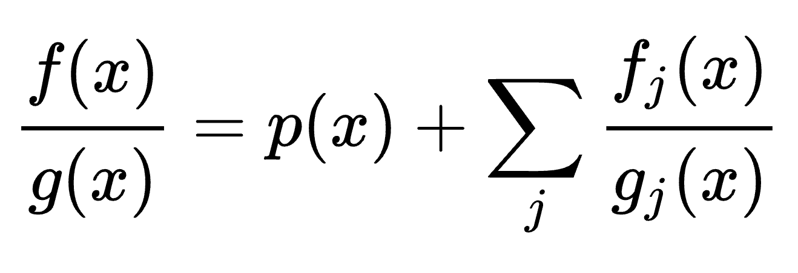

# A fast method for partial fraction decomposition

!!! warning "Generated by AI"

该方法适用于口算

<!-- more -->

### 口算案例

对于

$$
\frac{3x^2-x}{(x+1)(x-1)^2}=\frac A{x+1}+\frac B{x-1}+\frac C{(x-1)^2} 
$$

有

$$
A=\frac{3+1}{4}=1
$$

$$
 C=\frac{3-1}{2}=1
$$

将 $x=0$ 带入有

$$
 0=1-B+2
$$

所以 $B=2$，

$$
 \frac{3x^2-x}{(x+1)(x-1)^2}=\frac 1{x+1}+\frac 2{x-1}+\frac 1{(x-1)^2} 
$$

## 针对重根的“特值法”应用
假设有理分式包含一个 $k$ 阶重根 $r$，分解式包含以下部分：

$$
\frac{P(x)}{(x-r)^k Q_1(x)} = \frac{A_k}{(x-r)^k} + \frac{A_{k-1}}{(x-r)^{k-1}} + ... + \frac{A_1}{x-r} + \frac{\text{Other terms}}{Q_1(x)}
$$

### 1. 快速求出最高次项系数 \(A_k\)
为了求 $A_k$，我们执行以下“特值”操作：

1. 将等式两边同乘以 $(x-r)^k$。

$$
\frac{P(x)}{Q_1(x)} = A_k + A_{k-1}(x-r) + ... + A_1(x-r)^{k-1} + \frac{\text{Other terms}}{Q_1(x)} \times (x-r)^k 
$$

2. 代入特值 $x = r$。  
由于等式右边除了 $A_k$ 之外的所有项都包含 $(x-r)$ 因式，所以它们都等于零。

$$
A_k = \left. \frac{P(x)}{Q_1(x)} \right|_{x=r} 
$$

这就是留数法中求高阶极点最高次留数的思想。

### 2. 求解其他系数 (\(A_{k-1}\) 到 \(A_1\))
特值法在求出 $A_k$ 后就失效了。要继续求解 $A_{k-1}, A_{k-2}, ...$，通常需要结合其他方法：

| 方法 | 描述 | 特点 |
| :--- | :--- | :--- |
| **微分法/泰勒展开法** | 基于留数定理的思想，对 $\dfrac{P(x)}{Q_1(x)}$ 进行逐级求导和代入 $x=r$。 | **最系统，效率高**。能依次求出 $A_{k-1}, A_{k-2}, ...$。 |
| **代入其他任意值** | 求解 $A_k$ 后，代入其他简单的特值，如 $x=0, x=1, x=-1$ 等，得到关于 $A_j$ 的线性方程组，然后结合待定系数法解出。 | **最容易理解和操作**，但效率不如微分法。当系数不多时是好选择。 |
| **移项代入法** | 求出 $A_k$ 后，将 $\dfrac{A_k}{(x-r)^k}$ 移到左边，通分后，由于左边是真分式，新的分子应该包含 $(x-r)$ 因式，消去后得到一个更简单的分解式，再用同样的方法解下一项 $A_{k-1}$。 | 步骤繁琐，但避免了求导和解方程组。 |

---

## 例子演示（特值法 + 补充方法）
**问题：** 分解 $R(x) = \dfrac{x}{(x-1)^2 (x+2)}$。

**步骤 1: 设定分解形式。** 
根有 $r_1=1$（2阶重根）和 $r_2=-2$（单根）。

$$
\frac{x}{(x-1)^2 (x+2)} = \frac{A_2}{(x-1)^2} + \frac{A_1}{x-1} + \frac{B}{x+2} 
$$

**步骤 2: 使用特值法求单根系数 **$B$**。**

+ **乘 **$(x+2)$** 并代入 **$x=-2$**：**

$$
 B = \left. \frac{x}{(x-1)^2} \right|_{x=-2} = \frac{-2}{(-2-1)^2} = \frac{-2}{9} 
$$

**步骤 3: 使用特值法求重根最高次系数 **$A_2$**。**

+ **乘 **$(x-1)^2$** 并代入 **$x=1$**：**

$$
A_2 = \left. \frac{x}{x+2} \right|_{x=1} = \frac{1}{1+2} = \frac{1}{3} 
$$

**步骤 4: 求解 **$A_1$**（补充方法：代入其他任意值）。**

+ 现在我们有 $A_2=\dfrac13$ 和 $B=-\dfrac29$。我们代入另一个简单的特值，例如 $x=0$。

$$
\left. \frac{x}{(x-1)^2 (x+2)} \right|_{x=0} = \frac{A_2}{(0-1)^2} + \frac{A_1}{0-1} + \frac{B}{0+2} 
$$

$$
 0 = \frac{1/3}{1} - A_1 + \frac{-2/9}{2} 
$$

$$
0 = \frac{1}{3} - A_1 - \frac{1}{9} 
$$

$$
 A_1 = \frac{1}{3} - \frac{1}{9} = \frac{3}{9} - \frac{1}{9} = \frac{2}{9} 
$$

**最终分解式：**

$$
\frac{x}{(x-1)^2 (x+2)} = \frac{1/3}{(x-1)^2} + \frac{2/9}{x-1} - \frac{2/9}{x+2} 
$$

所以，**特值法对于重根仍然是一个关键且快速的步骤**，但它通常需要与其他方法（如微分或代入其他点）结合使用才能完成整个分解。
