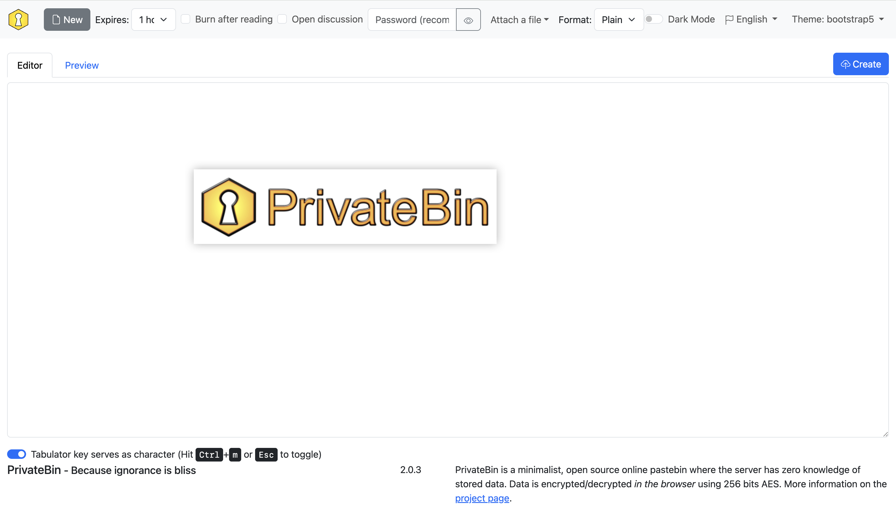

# How to build a pastebin website



近日给原来的 Pastebin 换了一个服务器，重新部署一遍，正好写一篇教程。

我选择的是 [PrivateBin](https://privatebin.info/)。

<!-- more -->

这里使用 Docker 来部署。

---

## PrivateBin

新建一个文件夹，然后新建一个 `docker-compose.yml`。

??? plain "docker-compose.yml"
    ```yaml linenums="1"
    services:
      privatebin:
        image: privatebin/nginx-fpm-alpine
        container_name: privatebin
        restart: always
        ports:
          - "8080:8080"
        volumes:
          - ./data/conf.php:/srv/cfg/conf.php
          - ./data/privatebin:/srv/data
    ```

```bash
docker compose up -d
```

稍等片刻，我们打开 `localhost:8080`，就能看到我们的 Pastebin 差不多搭好了，除了一个 HTTPS 的提示。

在 `./data` 我们也能看到新出现的文件：`conf.php`，你可以自己进行一些配置。

??? note "没看到 `conf.php` 怎么办"
    可以在仓库下载一份 Sample 文件。
    ```bash
    wget https://github.com/PrivateBin/PrivateBin/raw/refs/heads/master/cfg/conf.sample.php
    ```
    然后改个名就行了。

## HTTPS

接下来我们把 HTTPS 给打开，需要一个域名。

这里我使用了 Nginx 和 Certbot 获取证书。

首先要编辑一下 `docker-compose.yml`，加入 Nginx 和 Certbot。

> 这里可以把 `privatelink` 里面的 `ports: ["8080:8080"]` 删掉了。

??? plain "docker-compose.yml"
    ```yaml linenums="1"
    services:
      privatebin:
        image: privatebin/nginx-fpm-alpine
        container_name: privatebin
        restart: always
        volumes:
          - ./data/conf.php:/srv/cfg/conf.php
          - ./data/privatebin:/srv/data

      nginx:
        image: nginx:alpine
        container_name: nginx
        restart: always
        ports:
          - "80:80"
          - "443:443"
        volumes:
          - ./data/nginx/conf.d:/etc/nginx/conf.d
          - ./data/certbot/conf:/etc/letsencrypt
          - ./data/certbot/www:/var/www/certbot
        depends_on:
          - privatebin
          - shlink

      certbot:
        image: certbot/certbot
        container_name: certbot
        volumes:
          - ./data/certbot/conf:/etc/letsencrypt
          - ./data/certbot/www:/var/www/certbot
        entrypoint: "/bin/sh -c 'trap exit TERM; while :; do certbot renew; sleep 12h & wait $${!}; done;'"
    ```

然后我们要配置 Nginx。编辑 `./data/nginx/conf.d/default.conf`，`example.com` 换成自己的域名：

??? plain "default.conf"
    ```nginx linenums="1" hl_lines="3"
    server {
        listen 80;
        server_name example.com;
        
        location /.well-known/acme-challenge/ {
            root /var/www/certbot;
        }

        location / {
            return 301 https://$host$request_uri;
        }
    }
    ```

再新建一个 `./data/nginx/conf.d/proxy_params`：

??? plain "proxy_params"
    ```nginx linenums="1"
    proxy_set_header Host $host;
    proxy_set_header X-Real-IP $remote_addr;
    proxy_set_header X-Forwarded-For $proxy_add_x_forwarded_for;
    proxy_set_header X-Forwarded-Proto $scheme;
    proxy_connect_timeout 90;
    proxy_send_timeout 90;
    proxy_read_timeout 90;
    client_max_body_size 10m;
    ```

```bash
docker compose up -d
```

然后让 Certbot 申请证书，这里填一下邮箱和自己的域名。

```bash
docker exec certbot certbot certonly --webroot -w /var/www/certbot --email mail@example.com -d example.com --agree-tos --no-eff-email
```

!!! tip "这一步可能会需要找 AI 帮帮忙"

成功以后在 Nginx 的 `default.conf` 里面加上 HTTPS 的 `server`，填上自己的域名。

??? plain "default.conf"
    ```nginx linenums="1" hl_lines="3 16"
    server {
        listen 80;
        server_name example.com;
        
        location /.well-known/acme-challenge/ {
            root /var/www/certbot;
        }

        location / {
            return 301 https://$host$request_uri;
        }
    }

    server {
        listen 443 ssl;
        server_name example.com;

        ssl_certificate /etc/letsencrypt/live/example.com/fullchain.pem;
        ssl_certificate_key /etc/letsencrypt/live/example.com/privkey.pem;

        ssl_protocols TLSv1.2 TLSv1.3;
        ssl_ciphers HIGH:!aNULL:!MD5;

        location / {
            proxy_pass http://privatebin:8080;
            include /etc/nginx/conf.d/proxy_params;
        }
    }
    ```

重启一下这个 Docker，就搭建好啦。

## Shlink

哎，然后有人用着用着就感觉，这个链接好长啊，能不能缩短一点，对吧。

下面使用 Shlink 和 PrivateBin 的 URL Shortener 功能。

我本来是想用 PrivateBin 自己的 Shlink 接口的，但他这个接口不知道是我出问题了还是怎么样，在这个 Docker 的环境下就用不了。YOURLS 我也懒得试了，有时间的可以自己试一下，这里给出一个 Nginx 的方案，但安全性不是很高，仅供参考了。

首先在 `docker-compose.yml` 中加上 Shlink：

??? plain "docker-compose.yml"
    ```yaml linenums="1" hl_lines="10 16 34"
    services:
      privatebin:
        image: privatebin/nginx-fpm-alpine
        container_name: privatebin
        restart: always
        volumes:
          - ./data/conf.php:/srv/cfg/conf.php
          - ./data/privatebin:/srv/data

      shlink:
        image: shlinkio/shlink:stable
        container_name: shlink
        restart: always
        environment:
          - DB_DRIVER=sqlite
          - DEFAULT_DOMAIN=example.com
          - IS_HTTPS_ENABLED=true
        volumes:
          - ./data/shlink:/etc/shlink/data

      nginx:
        image: nginx:alpine
        container_name: nginx
        restart: always
        ports:
          - "80:80"
          - "443:443"
        volumes:
          - ./data/nginx/conf.d:/etc/nginx/conf.d
          - ./data/certbot/conf:/etc/letsencrypt
          - ./data/certbot/www:/var/www/certbot
        depends_on:
          - privatebin
          - shlink

      certbot:
        image: certbot/certbot
        container_name: certbot
        volumes:
          - ./data/certbot/conf:/etc/letsencrypt
          - ./data/certbot/www:/var/www/certbot
        entrypoint: "/bin/sh -c 'trap exit TERM; while :; do certbot renew; sleep 12h & wait $${!}; done;'"
    ```

```bash
docker compose up -d
```

然后获取 Shlink 的 API Key

```bash
docker exec -it shlink shlink api-key:generate
```

接下来编辑 Nginx 的 `default.conf`，填上 API Key：

??? plain "default.conf"
    ```nginx linenums="1" hl_lines="3 16 30"
    server {
        listen 80;
        server_name example.com;
        
        location /.well-known/acme-challenge/ {
            root /var/www/certbot;
        }

        location / {
            return 301 https://$host$request_uri;
        }
    }

    server {
        listen 443 ssl;
        server_name example.com;

        ssl_certificate /etc/letsencrypt/live/example.com/fullchain.pem;
        ssl_certificate_key /etc/letsencrypt/live/example.com/privkey.pem;

        ssl_protocols TLSv1.2 TLSv1.3;
        ssl_ciphers HIGH:!aNULL:!MD5;

        location = / {
            proxy_pass http://privatebin:8080;
            include /etc/nginx/conf.d/proxy_params;
        }

        location = /shorten.php {
            proxy_pass http://shlink:8080/rest/v3/short-urls/shorten?apiKey=xxxxxxxx-xxxx-xxxx-xxxx-xxxxxxxxxxxx&format=txt&longUrl=$arg_link;
            include /etc/nginx/conf.d/proxy_params;
        }

        location ~* ^/(css|js|img|webfonts|robots.txt|favicon.ico|manifest.json) {
            proxy_pass http://privatebin:8080;
            include /etc/nginx/conf.d/proxy_params;
        }

        location / {
            proxy_pass http://shlink:8080;
            include /etc/nginx/conf.d/proxy_params;
        }
    }
    ```

然后在 `conf.php` 中设置，这里可以打开 `shortenbydefault`。

??? plain "conf.php"
    ```ini linenums="82"
    ; (optional) URL shortener address to offer after a new document is created.
    ; It is suggested to only use this with self-hosted shorteners as this will leak
    ; the documents encryption key.
    urlshortener = "${basepath}shorten.php?link="

    ; (optional) Whether to shorten the URL by default when a new document is created.
    ; If set to true, the "Shorten URL" functionality will be automatically called.
    ; This only works if the "urlshortener" option is set.
    shortenbydefault = true
    ```

重启一下这个 Docker，就完成啦。
