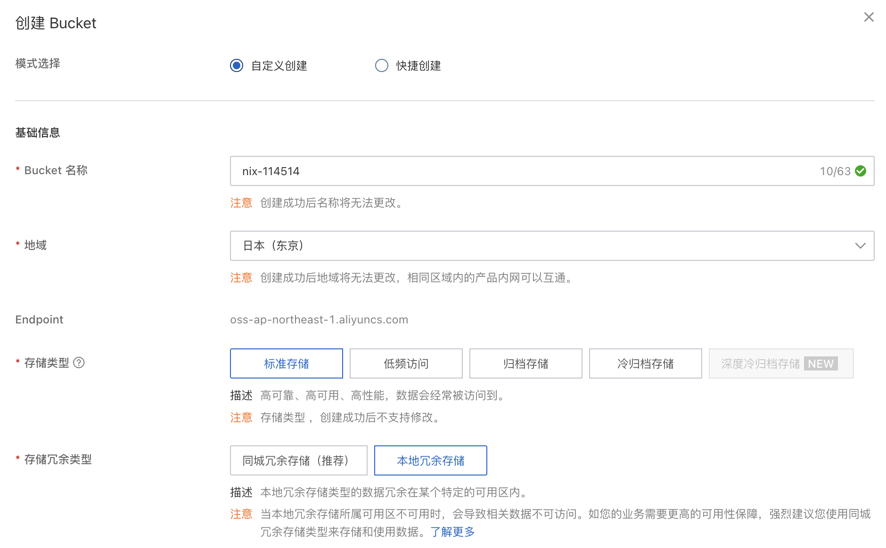
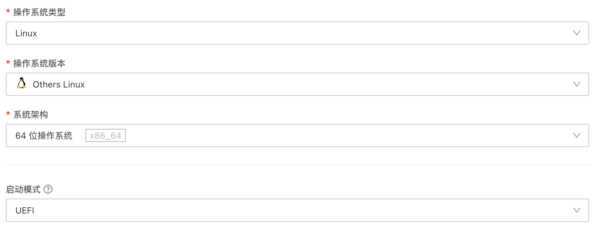
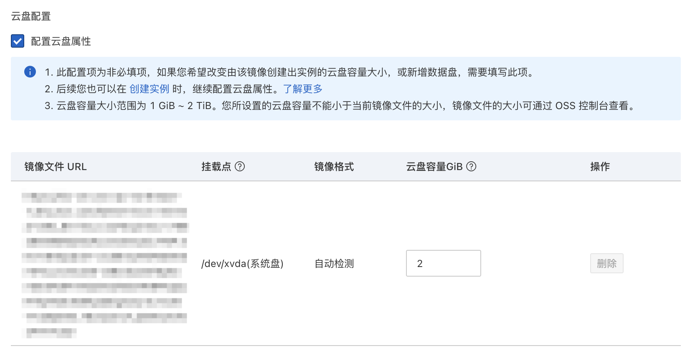
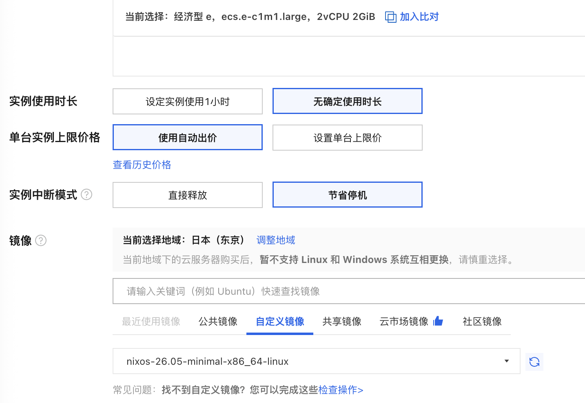
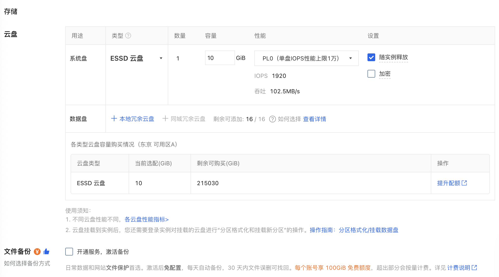
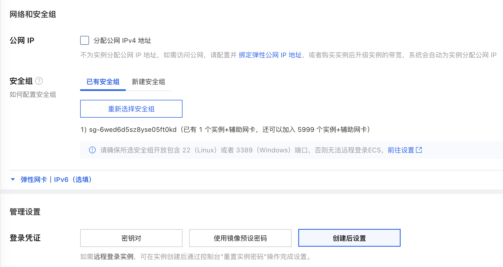
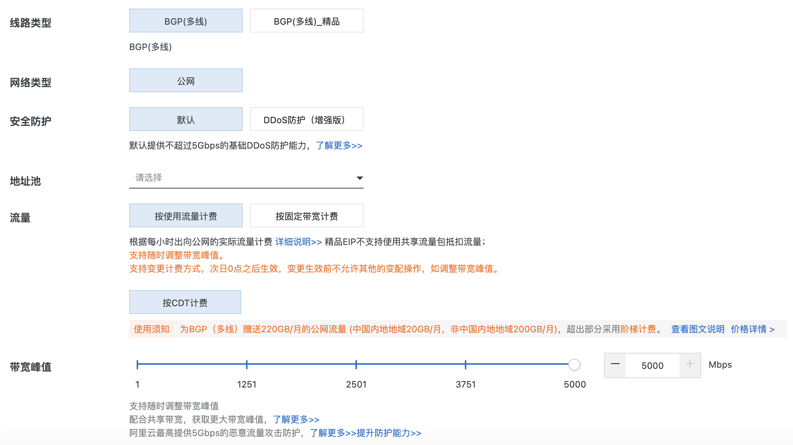
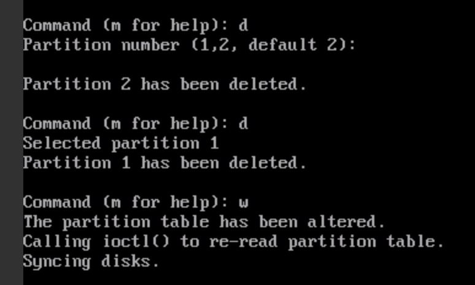
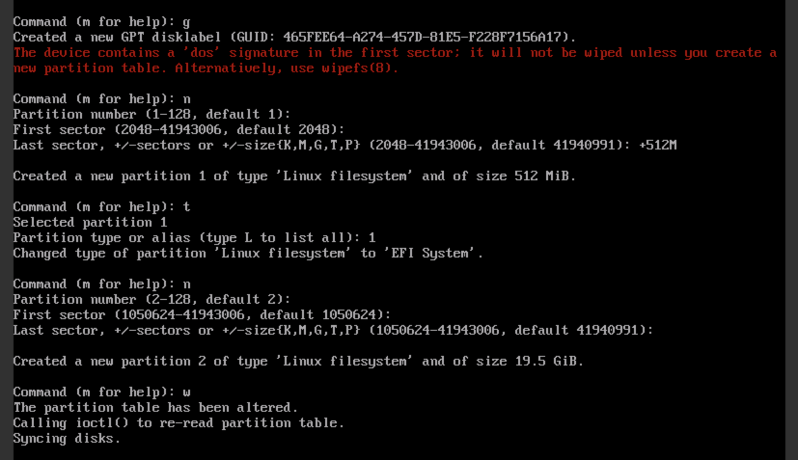
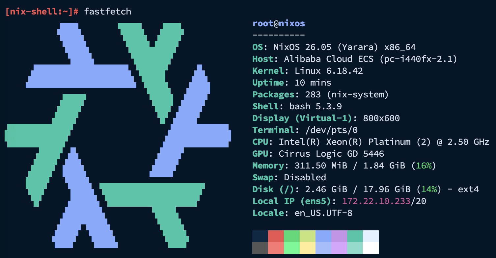

# Install NixOS on Aliyun for less than 20 CNY per month

主要参考了[这篇教程](https://bbs.biliup.rs/t/topic/46)，不过没有把成本压得这么低。

主要还是想体验一下 NixOS，~~同时消耗一下我用不完的学生优惠券~~。

<!-- more -->

## 前言

在开始前我先简要说一下这个的原理。

我们这里用的是阿里云 ECS 的抢占式实例，他的好处就是按量计费，并且非常便宜。
按量计费有一大优点就是，他是可以使用阿里云的 300 元学生券的，所以我们相当于可以白嫖一年，
一年以后再继续白嫖一张优惠券（这个应该是每年都可以领的）

另外，使用 ECS 而不是轻量服务器的优点是，他的带宽是可以随便拉的，最高 5Gbps（弹性公网 IP），
实测的话本地应该能跑到 2Gbps 左右，回国有的 IP 配合有的地区可以跑到 1Gbps 左右，
网络质量还算不错（这里我以日本地区为演示），并且有每月免费的 200G 单向，轻量使用应该是够了。

另外，建议选 BIOS 安装，你可以看到我的 UEFI 的安装步骤非常复杂，我也想不到更好的了..

差不多就这些，接下来是我对流程的一个记录。注意每一步流程都要选择相同的区域。

## 上传 NixOS 镜像

先打开[对象存储 OSS](https://oss.console.aliyun.com/bucket)（可能需要开通一下），
创建一个 Bucket，配置随便，你可以调低一点



然后直接上传文件，这里你需要把镜像给下载下来再上传上去。可以在
[NJU Mirror](https://mirror.nju.edu.cn/nixos-images/) 随便找一个新一点的版本，
选 `latest-nixos-minimal-x86_64-linux.iso` 就行。另外，建议找个上传高一点的网络环境，
比如校园网，不然你可能像我一样上传等了快一个小时（

上传完后查看一下文件的详情，会有一个很长的 URL 需要复制一下，然后我们打开
[ECS](https://ecs.console.aliyun.com/image) 选择导入镜像，填入刚刚复制的 URL，
正常填写剩余部分（这里最好选 BIOS，不然后续操作会非常麻烦）



最后在下方勾选配置云盘属性，然后把云盘容量调到越小越好（应该要比镜像文件大一点）



最后确认导入，等待进度变成 100%，状态变成可用即可。

## 创建抢占式实例

打开[购买界面](https://ecs-buy.aliyun.com/ecs#/custom/spotPostpay)，
选择抢占式实例，选择一个小一点的规格（比如我选的 `ecs.e-c1m1.large`），
下面几个设置照着我的选，然后选择刚刚创建的镜像



然后配置存储，这里选 ESSD 云盘，可以做到容量特别小，不过我没有选的很极限，毕竟我要正常用的。

其实主要的价格都在这个硬盘上，所以比如你可以装一个 Alpine，然后硬盘开特别小，只用来白嫖流量。

如果你是选的 UEFI 的话，你还需要再开一个实例，硬盘 2G 就够，或者多开点也行，用来安装系统。



再到下面取消掉公网 IP（后面会用弹性公网 IP），登陆凭证选创建后设置



那么现在就可以下单了，我假设你选了 BIOS，加了 10G 的盘，现在我这里显示的价格是 ￥0.019319/时，
就是 ￥13.9/月，这个价格可能会波动，不过总之非常便宜。接下来需要设置弹性公网 IP。

## 绑定弹性公网 IP

为什么用弹性公网 IP 呢？有两个好处，第一个是，他带宽能拉到 5Gbps，不过我实测在 2Gbps 左右，
回国最高 1Gbps；第二，如果你的 IP 网络质量比较差，你大可以马上换一个，比固定 IP 要方便。

你也不想用 100Mbps 还一直断流吧（

实例启动后我们点 `全部操作 > 绑定弹性公网 IP`，然后创建弹性公网 IP，这里带宽可以拉满



创建后绑到这个实例即可访问。

## 安装 NixOS (UEFI)

对于 UEFI，你需要两个实例，一个用于安装（2G 就够），一个是最终的系统。

关掉最终留下的实例，在左栏的块存储卸载掉对应的系统盘，然后再在另一个实例里挂载云盘。

接下来进入这个有两个盘的实例的 VNC，开始分区

```bash
sudo -i
fdisk /dev/vdb
```

先删除原有分区



然后重新分区



格式化和挂载

```bash
mkfs.fat -F 32 /dev/vdb1
mkfs.ext4 -L nixos /dev/vdb2

mount /dev/vdb2 /mnt
mkdir -p /mnt/boot
mount /dev/vdb1 /mnt/boot
```

生成配置文件，安装 NixOS

```bash
nixos-generate-config --root /mnt
nixos-install
```

装好以后把盘卸载，挂载到原来的实例里（这里密码随便填，最后用的还是你原来的密码），
这样就装好了，应该可以正常启动。

然后可能需要把 SSH 打开，如果你需要 root 登陆也需要配置一下

```bash
nano /etc/nixos/configuration.nix
nixos-rebuild switch
```

```lua
services.openssh = {
  enable = true;
  openFirewall = true;

  settings = {
    PermitRootLogin = "yes";
    PasswordAuthentication = true;
  };
};
```

就成功啦。最后

```bash
nix-shell -p fastfetch
fastfetch
```


