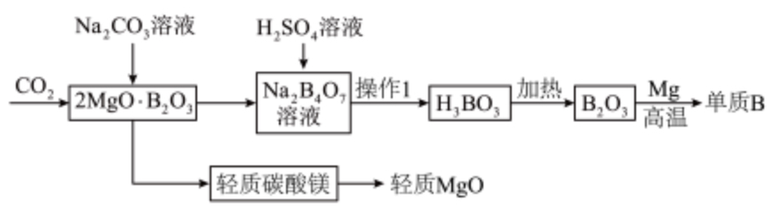
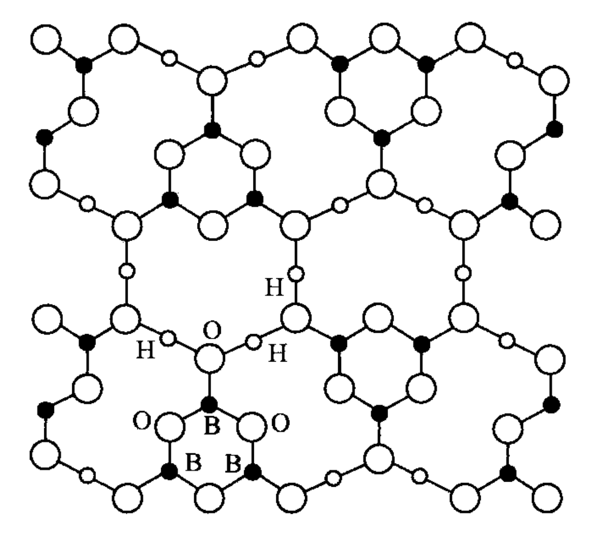
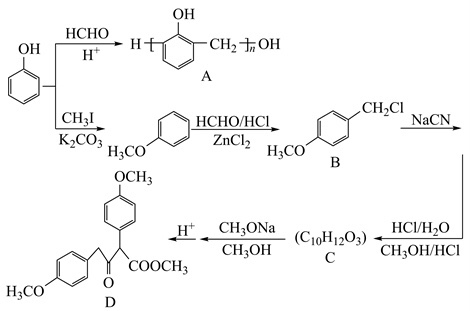

# Some questions I set

是一些很乱的一个整理，从家里翻出来的一堆东西。没什么用。

只是觉得弃之可惜。

<!-- more -->

## Math

/// details | Problem 1
古埃及习惯用多个分子为 $1$，分母不同的分数来表示任意分数。对于正整数 $p,q$ 满足 $p<q$，若 $\dfrac pq=\displaystyle\sum_{k=1}^n\frac1{a_k}$（$a_k$ 为互不相等的正整数），则称 $\displaystyle\sum_{k=1}^n\frac1{a_k}$ 为 $\dfrac pq$ 的一个“ $k$ -单位分数表示”，例如：$\dfrac3{10}$ 的一个 “ $3$ -单位分数表示”为 $\dfrac15+\dfrac1{15}+\dfrac1{30}$。回答下列问题：

(1) 写出 $\dfrac16$ 的两种“ $3$ -单位分数表示”

(2) 求证：对任意的正整数 $a\ge2$，$\dfrac1a$ 均存在一种“ $k$ -单位分数表示”，其中 $k$ 可取任意正整数。

(3) 已知正整数 $\lambda$ 满足 $0\le\lambda\le n$。若从 $\{1,2,\cdots,3^n-1\}$ 中任选一个数 $b$（选中每个数的概率相同），记 $\dfrac b{3^n}$ 存在“ $3\lambda$ -单位分数表示”的概率为 $p$，求证：

$$p>\dfrac{(\lambda+1)^2}{3^n-1}$$
///

/// details | Problem 2
实数 $x,y,z,a,b,c$ 满足

$$x+y+z=\frac1a+\frac1b+\frac1c=0$$

$$x^2+y^2+z^2=6-3\sqrt3$$

求

$$S=(x-a+1)^2+(y-b+1)^2+(z-c+1)^2$$

的最小值
///

/// details | Problem Set 1
对于 $n\in N^{\ast }$ ，我们把小于 $n$ 的正整数中与 $n$ 的最小公倍数为 $1$ 的数的个数记为 $\varphi (n)$ ，例如 $\varphi (5)=4$ 

(1) 求 $\varphi \left( 3^{n}\right) ,\varphi \left( 4^{n}\right)$ 

---

已知数列 $\{a_{n}\}$ 的前 $n$ 项和为 $S_{n}$ ，数列 $\{b_{n}\}$ 的前 $n$ 项和为 $T_{n}$ 

(1) 若 $a_{n}=n\left( n+3\right)\cdot2^{n}$ ，求 $S_{n}$ 

(2) 在(1)的条件下，若 $b_{n}=\dfrac {n^{2}+2n+2}{S_{n}}$ ，求 $T_{n}$ 

---

已知数列 $\{a_{n}\}$ 满足 $a_{n}=2n-1$ ，且 $\forall n\in N^{\ast }, S_{n}=\dfrac {\sin a_{1}x}{a_{1}}+\dfrac {\sin a_{2}x}{a_{2}}+\cdots+\dfrac {\sin a_{n}x}{a_{n}}\geq 0$ ，求 $x$ 的取值范围

---

已知数列 $\{a_{n}\}$ 满足 $a_{n}=1,a_{n+1}=a^{2}_{n}-\left( n+1\right) a_{n}+1$ 

(1) 求 $\{a_{n}\}$ 的通项公式

(2) 若 $b_{n}=\dfrac {3n+5}{\left( a^{2}_{n}-1\right) a_{n}}$ ，数列 $\{b_{n}\}$ 的前 $n$ 项和为 $T_{n}$ ，求证： $T_{n} < \dfrac {5}{6}$ 

---

数学上常用 $\prod\limits ^{n}_{i=1}a_{i}$ 表示 $a_{1},a_{2},\cdots,a_{n}$ 的乘积， $\prod\limits ^{n}_{i=1}a_{i}=a_{1}\cdot a_{2}\cdots a_{n},n\in N^{\ast }$ 

(1) 证明： $\prod\limits ^{n}_{i=1}\dfrac {2i}{2i-1} > \sqrt {2n+1}$ 

(2) 数列 $a_{n},b_{n}$ 满足 $a_{n}=n,b_{n}=\dfrac{a_{1}^{2}\cdot a_{3}^{2}\cdots a_{2n-1}^{2}}{(2n)!}$ ，证明： $\sum\limits ^{n}_{i=1}b_{i} < \sqrt {2n+1}-1$ 

---

已知数列 $\{a_{n}\}$ 的前 $n$ 项和为 $S_{n}$ ，且满足 $a_{1}=1,a_{n+1}-a_{n}=f(a_{n})$ 

(1) 若 $f\left( x\right) =\dfrac {x\sqrt {x}\left( 1-x\right) }{\left( \sqrt {x}-1\right) ^{3}}$ ，求证： $\dfrac {3}{2} < S_{2024} < \dfrac {5}{2}$ 

(2) 若 $f\left( x\right) =-\dfrac {1}{3}x^{2}$ ，求证： $\dfrac {5}{2} < 100a_{100} < 3$ 

---

已知数列 $\{a_{n}\}$ 的前 $n$ 项和为 $S_{n}$ ，且满足 $a_{1}=1$ ， $a_{n+1}=2e^{a_{n}}+a_{n}$ 

(1) 证明： $S_{n}\geq 3^{n}-n-1$ 

(2) 证明： $( 1+\dfrac {1}{5a^{2}_{2}}) ( 1+\dfrac {1}{5a^{2}_{3}})\cdots(1+\dfrac{1}{5a^{2}_{n}})<\sqrt[3]{e}$ 
///

## Chemistry

/// details | Problem 1
下列说法正确的是

A. 中碳钢强度高，可用于制作地铁列车的车体

B. 铬酸作氧化剂可使铝制品的氧化膜产生美丽的颜色

C. 考古研究中常利用 $^{14}\mathrm C$ 和 $^{15}\mathrm N$ 的测定来分析古代人类的食物结构

D. 如果不慎将酸沾到皮肤上，应立即用大量水冲洗，然后涂上 $3\%-5\%\,\mathrm{NaHCO}_3$ 溶液
///

/// details | Problem Set 1
以下材料一定不能用于制作钻头或轴承的是

A. $Al_{2}O_{3}$

B. $Cr$

C. $Pt$

D. $Si_{3}N_{4}$

---

类比推理是化学中常用的思维方法，下列说法正确的是

A. 常温下甲醇不能与新制 $Cu(OH)_{2}$ 溶液反应，则常温下甘油也不能与新制 $Cu(OH)_{2}$ 溶液反应

B. 硫酸钡不能与硫酸反应，则磷酸钡也不能与磷酸反应

C. $NaCl$ 与浓硫酸共热能制取 $HCl$ ，则 $NaI$ 与浓硫酸共热也能制取 $HI$

D. 灼烧 $NaNO_{3}$ 不能生成单质 $Na$ ，则灼烧 $Cu(NO_{3})_{2}$ 也不能生成单质 $Cu$

---

硼是一种重要的化工原料，硼制品广泛应用于化工、冶金、光学玻璃、医药、橡胶及轻工业。请回答下列问题：

I 工业上硼的冶炼流程：

(1) 流程中第一步涉及反应的化学方程式为

(2) 制备单质B过程中易生成含硼杂质，该杂质的化学式是

II 硼存在多种含氧酸

(3) 写出正硼酸 $H_{3}BO_{3}$ 在水中的电离方程式；该反应 $K=10^{-9.34}$ ，取 $50mL$ 正硼酸溶液加入一定量甘露醇 $C_{6}H_{14}O_{6}$ 后用 $0.1000mol/LNaOH$ 标准溶液滴定并用pH计实时测定溶液pH。甘露醇的作用是

(4) 下图为一种硼酸的晶体结构，该硼酸的分子式是

(5) $NaBH_{2}O_{4}$ 受热不易分解，是一种温和的氧化剂，在潮湿热空气中分解放氧，也可用作织物漂白剂。$NaBH_{2}O_{4}$ 中有两种不同化学环境的氧原子，则阴离子的结构式为

III 硼可以形成一系列氢化物，它们性质类似于烷烃，所以被称作硼烷

(6) 最简单的硼烷是乙硼烷 $B_{2}H_{6}$ ，结构与 $AlCl_{3}$ 二聚体类似。写出 $B_{2}H_{6}$ 的结构式

(7) 科学家至今没有发现 $BH_{3}$ 的存在，但存在稳定的 $BF_{3}$ 。写出可能的原因

---

以甲醛和苯酚为主要原料，经下图所示系列转化可合成酚醛树脂和重要有机合成中间体D。部分反应条件和产物略去，回答下列问题：

(1) 用系统命名法命名A的单体； $HCHO$ 过量时生成的A难溶于水，原因是

(2) C中所含官能团的名称是

(3) 写出生成 $PhOCH_{3}$ 的反应方程式； $K_{2}CO_{3}$ 的作用是

(4) B的同分异构体中，含苯环的共有___种（不含立体异构）

(5) D与氢气完全加成后产物的一氯代物最多有___种手性异构体

(6) 写出以 $CH_{3}OH$ 为原料（无机试剂任选）制备化合物 $CH_{3}COCH_{2}COOCH_{3}$ 的合成路线
///

/// details | Exam 1
Video: <https://www.bilibili.com/video/BV1Da411D7Br>

Download: <https://wwb.lanzouy.com/ixljS07s9hpc>

Errata:

12.

II取I中所得滤液加入少量X溶液，此时溶液颜色为紫色；再加入过量Ba(OH)2溶液，过滤，所得滤液的颜色为蓝色。

IV取II中所得滤液加入过量稀硝酸和少量Y溶液，产生白色沉淀；过滤。

（3）IV中所得滤液的颜色为\_\_\_\_\_\_\_\_。
///