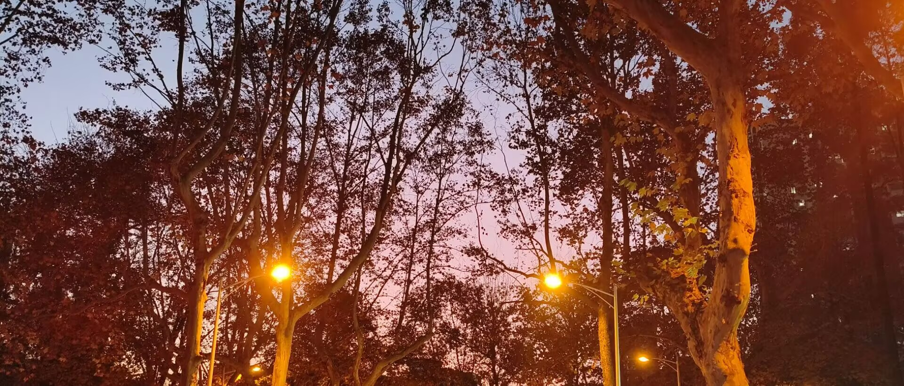
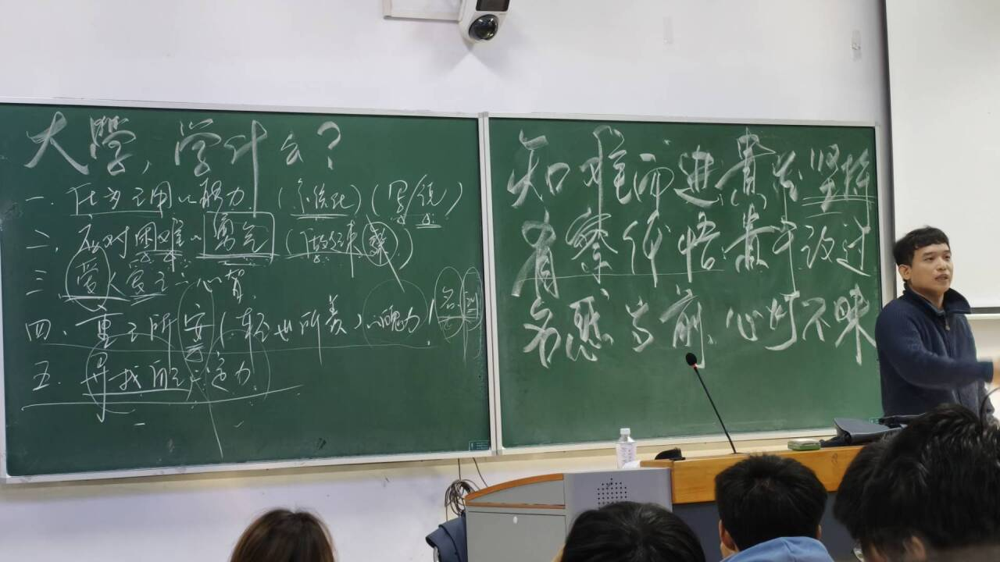
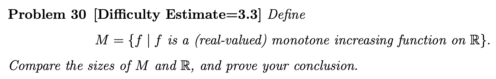
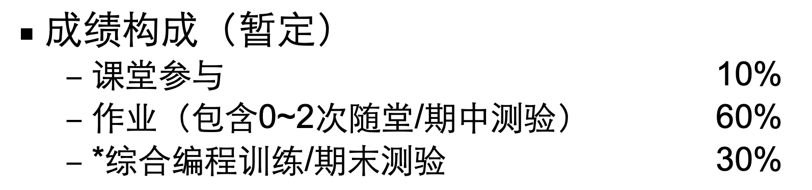

# The fall of my freshman year



一个普通的 Review。会慢慢更新。

<!-- more -->

---

## 专业课简评

### 计算机程序的构造与解释（SICP）91

我是跨选的 sicp，因为和 cpppl 冲了所以免修了，课也去的比较少。但我觉得这是我这个学期在南大听的最震撼的一门课。



[樾哥](https://cs.nju.edu.cn/yueli/)虽然身体好像不太好，但上课非常有激情，讲得很生动，而且有互动环节（~~我因为在群里最后一个发言而被点上去过一次~~）

助教团非常热情，课程群有“大一的木斧助教”，结课后还有和助教 gg 一起的团建活动。

总的来说，课程质量是非常高的。作业虽然往年有很多人说难，但是实际上如果不做 Just For Fun (Optional) 部分的话，还是不算难的。主要难点其实在于最后学 Scheme 的时候，Scheme 神奇的语法实在是有点反直觉，也不太好写。

/// details | [Scheme K-Curry](https://sicp.pascal-lab.net/2025/homework/hw09/4_4.html) （这个写了我两个小时）
    type: plain
```scheme linenums="1"
(define-macro (k-curry fn args vals indices)
  (define (h1 args indices i)
    (cond
      ((null? args) '())
      ((and (not (null? indices)) (= i (car indices)))
        (h1 (cdr args) (cdr indices) (+ i 1)))
      (else (cons (car args)
        (h1 (cdr args) indices (+ i 1))))
    )
  )
  (define (h2 args vals indices i)
    (cond
      ((null? args) '())
      ((and (not (null? indices)) (= i (car indices)))
        (cons (car vals) (h2 (cdr args) (cdr vals) (cdr indices) (+ i 1))))
      (else (cons (car args)
        (h2 (cdr args) vals indices (+ i 1))))
    )
  )
  `(lambda ,(h1 args indices 0) ,(cons fn (h2 args vals indices 0)))
)
```
///

关于考试：

- 期中很有点难，特别是 <u>P4: One Function For All</u>（内容是 lambda 与 foldl foldr），只考了七十多。
- 期末挺简单的，但是 89.5 有点难受了。（~~提前交卷结果看漏了一道题..3 分没了~~）

总的来说给分也挺好，没有平时分所以可以全翘（？

> 作业 50% + 期中 25% + 期末 25%
>
> 感觉应该是能见到的作业分最多的课了。

跨选了这门课虽然有点累，但最后还是很有成就感的。


---

### 信息与计算科学导论（离散数学 I）98

这门课其实就是离散改了个名，讲了集合论和递归。

> 今年还有神奇的拓展小知识（图灵机，Lean4）
> 
> 可以玩一玩这个[好玩的小游戏](https://adam.math.hhu.de/#/g/leanprover-community/nng4)

[Zsir（仲老师）](https://cosec.nju.edu.cn/ae/82/c47361a568962/page.htm)课上讲的比较直白简单，但作业难度挺大的，但是可以写 Give up


前面集合论我做了两次 Challenge Seeker，两次 Hacker，一次 Poet 的作业。Challenge Seeker 的作业是真的难写，好像有概率碰到 IMO 的题（反正都是竞赛题）。Hacker 的作业一般比较简单（敲代码），和 Experienced 难度相当。Poet 一般每次的题目都很有趣（写一篇小论文，比如[这个](./the-storm-in-foundational-mathematics-konigs-paradox.md)），看到感兴趣的写一下还是很好玩的。后面递归和图灵机的部分我没听懂（但好像这些内容比集合论简单，我只是书看少了），只好全部 Give up 了。。

Zsir 讲课还是很直白易懂的，但是由于一些神奇的原因这个授课是一句中文一句英文（讲嗨了会一直英文，时间不够了会一直中文），听感非常的神秘，间接让本来还比较易懂的课程内容变难了。

课程给分非常有特色，没有平时分和作业分（？

作业只要交了（写 Give up 也可以）就不会扣分，起始分数是 80 分，然后可以通过拿 Bonus 的方式来获得高分，具体指作业的优秀奖和提名奖，讲题的优秀奖和提名奖和课上回答问题，还有一些其他的特殊机会（比如问卷）。

上课会有激情的抢 Bonus 环节，在内容较简单的时候甚至有座位区域限制和学号尾号限行（？

我上课抢了五个 Bonus，作业拿了两次提名奖（这个奖还会有小礼品——一本书），还有两次问卷的 Bonus，没有参加讲题。这个 Bonus 的算法不是公开的，也一直没有人摸索出来，我也拿不准。（我怎么拿的 98 ？？）

/// details | 能做出来这种题真的很有成就感..
    type: example

其实我没做出来（）做错了
///

---

### 信息与计算科学导论实验（CppPL）

有点难评。上课讲的是基础的 C++ 语法，但是课程作业是不知什么难度的 OI 题。

期中期末考的时间正好和 SICP 冲突了，导致我没有见到樾哥的第一面和最后一面。所以对这门课的印象不是很好。

考试题比较简单，期末没什么问题，期中我第一题莫名其妙炸了（到现在都没找出来问题在哪）导致期中差几分及格。为什么会这样呢？因为考试的简单题目占据了大量分值，难题往往只有 10 分。

作业。。有一道紫题啊。紫题啊。

/// details | 吓死人的作业：[UVA1205 Color a Tree](https://www.luogu.com.cn/problem/UVA1205)
    type: example

</br>

!!! plain inline end "难度：<font color="purple">省选/NOI−</font>"

<h1>UVA1205 Color a Tree</h1>

<h2>题目描述</h2>

给定一棵有 $N$ 个节点的树，树根为 $R$ ，现在欲给这棵树的所有节点染色。给点 $i$ 染色的代价为 $t\cdot a_i$，其中 $t$ 代表这是第几次染色，$a_i$ 是给定的权值。

此外，**染一个点前，它的父节点必须已染好色**（所以根节点 $R$ 一定最先被染色）。求染完这棵树最小的代价。

<h2>输入格式</h2>

**本题有多组测试数据。**

对于每组数据，第一行是两个整数 $N$ 和 $R$，表示树的节点数和树根的编号。

第二行是 $N$ 个整数，第 $i$ 个整数代表 $a_i$，含义见题面。

接下来 $\left(N-1\right)$ 行，每行两个整数 $u,v$，**表示 $u$ 是 $v$ 的父亲。**

数据结尾的标志是 $N=R=0$。**你并不需要处理这组数据。**

<h2>输出格式</h2>

对于每组数据，输出一行一个整数，表示最小代价。

<h2>输入输出样例 #1</h2>

<div class="grid" markdown>

``` title="输入 #1"
5 1
1 2 1 2 4
1 2
1 3
2 4
3 5
0 0
```

``` title="输出 #1"
33
```

</div>

<h2>说明/提示</h2>

$1\leq R \leq N\leq 10^3$，
$1\leq a_i\leq 500$。
///

给分据说非常好（信计课都这样是吧），同样是不知道最后会怎么调分。

??? quote "有一个暂定的分数构成..看起来就很不靠谱"
    

---

### 微积分 I 71

上课讲的慢吞吞的，期末前勉勉强强把课上完了。我认为微积分不是很难，至少相对线代而言。但我期中期末都考的不咋样。

今年的期末题目和往年卷差异比较大，因此体感难度比较大。（实际难度也很大）

/// details | 神秘的考试题目
    type: example
一道课本原题，但是很多人忘了怎么做：

$$\lim_{n\to\infty}\int_0^1x^n4^x\cos(nx)\d x$$

两道计算量比较大的积分：

$$\int\frac{x+3}{(x^2+x+1)^{\frac32}}\d x,\quad\int x\arctan^2x\d x$$

一道经典的积分（较难）：

$$\int_0^1\frac{\ln(1+x)}{1+x^2}\d x$$

??? note "这道题有一个神奇的解法，你绝对想不到"
    $$I\xlongequal{x=\frac{1-t}{1+t}}\int_0^1 \frac{\ln 2}{1+t^2}\d t - \int_0^1 \frac{\ln(1+t)}{1+t^2}\d t=\frac\pi4\ln 2-I$$

    所以

    $$\int_0^1\frac{\ln(1+x)}{1+x^2}\d x=I=\frac\pi8\ln2$$

一道答案看不懂的积分（困难）：

$$\lim_{n\to\infty}(\int_1^2e^{-nt^2}\d t)^{\frac1n}$$

一个基本的证明（但还是有人考场上不会证，对就是我）：

$$f(x)>0\Rightarrow\int_0^1\ln f(x)\d x\le\ln\int_0^1f(x)\d x$$
///

---

### 线形代数 69

感觉和中学以来学的完全是两个不同的体系，因此学起来非常吃力，我个人认为难度很大。

期中考了一堆计算，我算错了很多，喜提不及格。期末在往年卷都有大量证明的前提下，今年的试卷证明较少，反倒考了大量计算，导致体感难度较大（我觉得实际难度其实不大，主要是和往年差异太大）。

不过期中之后我第一次学线代是期末前三天，我居然能及格也是很神奇了。

> 期末最后一题是证明 QR 分解的存在和唯一性。
>
> 我要是认真看了讲义就好了..
